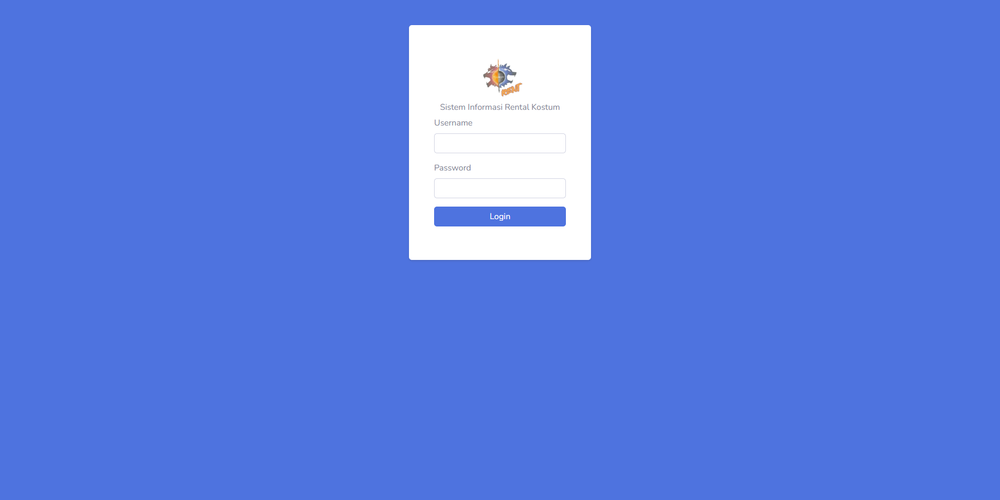
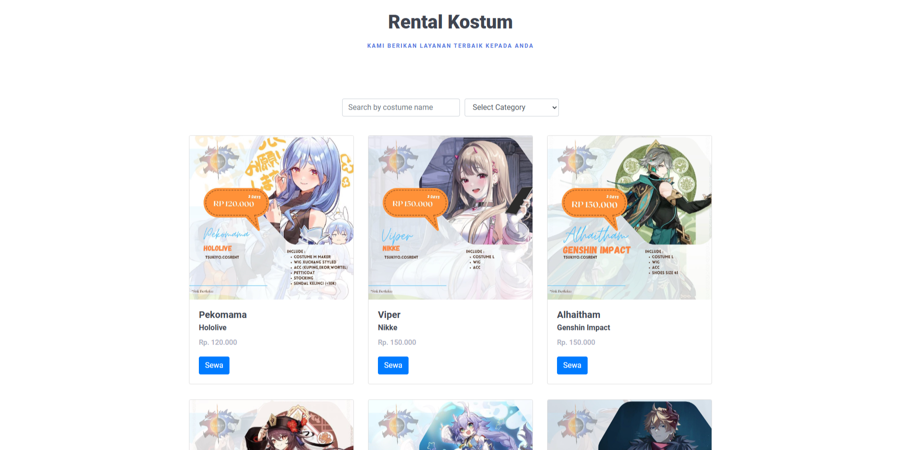
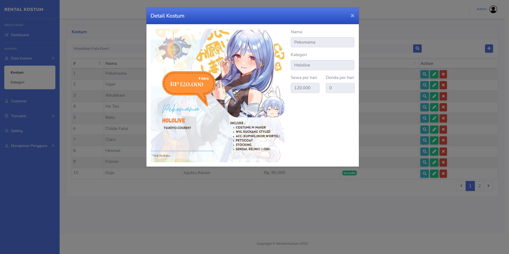

---





# Rental Kostum

Welcome to the Rental Kostum project! This Laravel application is designed to streamline costume rental management. Follow the steps below to set up and run the project on your local development environment.

## Table of Contents

- [Overview](#overview)
- [Requirements](#requirements)
- [Installation](#installation)
- [Configuration](#configuration)
- [Usage](#usage)
- [Additional Notes](#additional-notes)

## Overview

Rental Kostum is a Laravel-based application that helps users manage costume rentals. It includes features such as user authentication, costume catalog management, and payment gateway.

## Requirements

Before you begin, ensure you have the following installed on your machine:

- **PHP**: 7.2.0 or higher
- **Composer**: PHP dependency manager
- **Database**: MySQL or compatible
- **Local Development Environment** (Optional but recommended for Windows users): Laragon or similar

## Installation

#### 1. Clone the Repository

Clone the repository to your local machine using Git:

```bash
git clone https://github.com/vedri45/RentalKostum.git
cd RentalKostum
```

#### 2. Install Dependencies

Run Composer to install the project dependencies:

```bash
composer update
```

## Configuration

#### 1. Create Environment File

Duplicate the provided `.env.example` file to create a new `.env` file:

```bash
cp .env.example .env
```

#### 2. Create Storage Link

Generate a symbolic link to the storage directory to handle file uploads and asset serving:

```bash
php artisan storage:link
```

#### 3. Update Environment Variables

Open your `.env` file in the root directory of your project and update it with the necessary configuration details. Below is an example of the required configuration, including the Midtrans credentials:

```dotenv
APP_NAME=Rental Kostum
APP_ENV=local
APP_KEY=base64:your-app-key
APP_DEBUG=true
APP_URL=http://localhost

DB_CONNECTION=mysql
DB_HOST=127.0.0.1
DB_PORT=3306
DB_DATABASE=your-database-name
DB_USERNAME=your-database-username
DB_PASSWORD=your-database-password

MAIL_MAILER=smtp
MAIL_HOST=smtp.mailtrap.io
MAIL_PORT=2525
MAIL_USERNAME=your-mail-username
MAIL_PASSWORD=your-mail-password
MAIL_ENCRYPTION=null
MAIL_FROM_ADDRESS=null
MAIL_FROM_NAME="${APP_NAME}"

MIDTRANS_SERVER_KEY=your-midtrans-server-key
MIDTRANS_CLIENT_KEY=your-midtrans-client-key
```

1. **Obtain Midtrans Credentials**: Log in to your Midtrans account to get your `MIDTRANS_SERVER_KEY` and `MIDTRANS_CLIENT_KEY`.

2. **Update Keys**: Replace `your-midtrans-server-key` and `your-midtrans-client-key` with the actual values from your Midtrans account.

## Usage

#### 1. Start the Development Server

To start the local development server, use Laravel's Artisan command:

```bash
php artisan serve
```

By default, the application will be accessible at `http://localhost:8000`.

#### 2. Run Migrations

Set up the database schema by running the migrations:

```bash
php artisan migrate
```

#### 3. Seed the Database (Optional)

If you need initial data in your database, you can run database seeding:

```bash
php artisan db:seed
```

## Additional Notes

- **Testing**: You can run tests using PHPUnit with the command `phpunit` or `./vendor/bin/phpunit`.
- **Debugging**: Laravel Debugbar is included for debugging; you can enable it by setting `APP_DEBUG=true` in your `.env` file.
- **Documentation**: For more information on Laravel features and functionalities, refer to the [official Laravel documentation](https://laravel.com/docs).

---